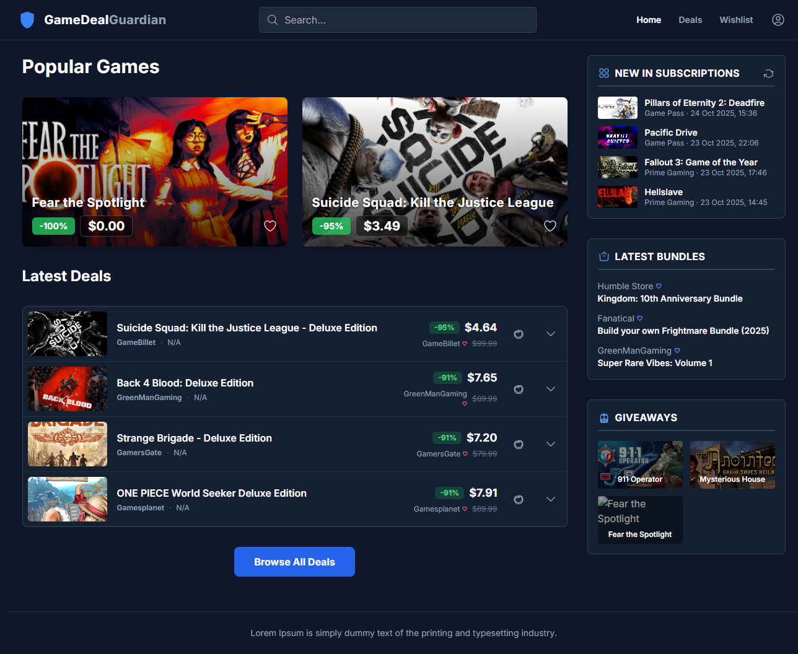
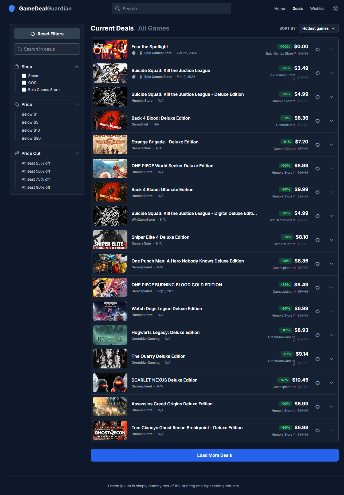
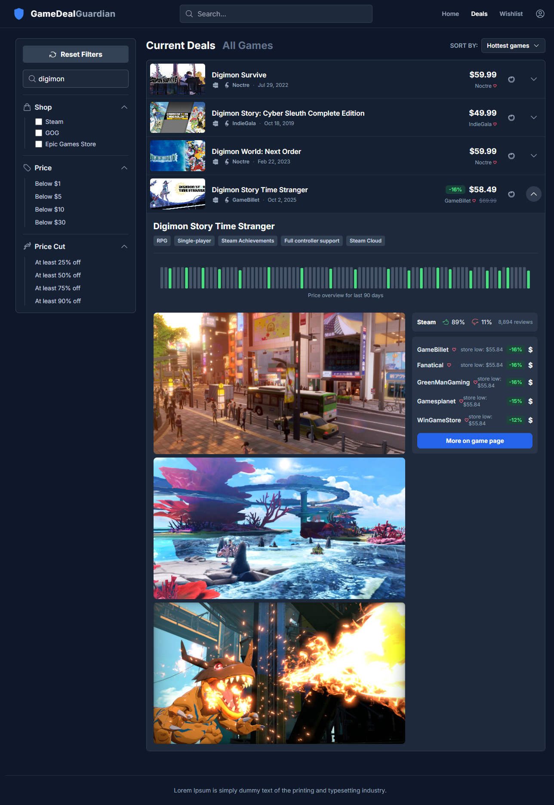
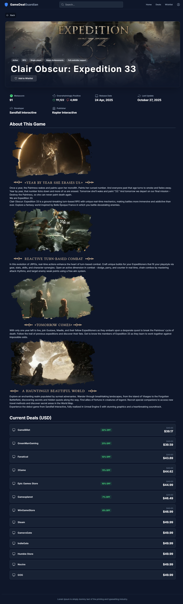

# 🛡️ Game Deal Guardian

A cross-platform price tracker and deal alert application designed to help gamers save money by monitoring video game prices across multiple digital storefronts. Find the best deals, track prices, and get alerts for your wishlist, all in one place. This web-app is a work in progress.

## ✨ Features

-   **Comprehensive Deal Discovery:** Browse a constantly updated list of the latest game deals from various stores.
-   **Powerful Search:** Instantly search for any game across the entire catalog.
-   **Advanced Filtering & Sorting:** Narrow down deals by store, price, discount percentage, and more. Sort results by deal rating, price, release date, and Metascore.
-   **Detailed Game Views:** Get in-depth information for each game, including descriptions, screenshots, developer/publisher info, and Metacritic scores, powered by the Steam API.
-   **Personal Wishlist:** Add games to your wishlist to keep an eye on their prices and deals.
-   **Price History:** Visualize price trends for games to make informed purchasing decisions.
-   **Responsive Design:** A clean, modern, and fully responsive UI that works beautifully on desktop and mobile devices.

## 🛠️ Tech Stack

This project is built with:

-   **Framework:** [React](https://reactjs.org/)
-   **Language:** [TypeScript](https://www.typescriptlang.org/)
-   **Styling:** [Tailwind CSS](https://tailwindcss.com/)

## 🔌 APIs & Services

Game Deal Guardian relies on external APIs to provide its data. A huge thank you to the creators of these fantastic services!

-   ### [CheapShark API](https://apidocs.cheapshark.com/)
    -   **Usage:** The primary source for all deal information, including prices, store data, and game lookups.
    -   **Endpoints Used:** `/deals`, `/games`, `/stores`.

-   ### [Steam API](https://partner.steamgames.com/doc/webapi)
    -   **Usage:** Used to enrich game data with detailed descriptions, screenshots, Metacritic scores, release information, and user reviews.
    -   **Note:** As this API is called from the client-side, requests are routed through a CORS proxy (`corsproxy.io`) to prevent cross-origin issues.

## 🚀 Getting Started

Follow these instructions to get a local copy of the project up and running.

### Prerequisites

Make sure you have the following software installed on your machine:
-   [Node.js](https://nodejs.org/en/) (v18 or later recommended)
-   [npm](https://www.npmjs.com/get-npm) or [yarn](https://yarnpkg.com/getting-started/install)

### Installation & Setup

1.  **Clone the repository:**
    ```bash
    git clone https://github.com/your-username/game-deal-guardian.git
    ```

2.  **Navigate to the project directory:**
    ```bash
    cd game-deal-guardian
    ```

3.  **Install dependencies:**
    Using npm:
    ```bash
    npm install
    ```
    Using yarn:
    ```bash
    yarn install
    ```

### Running the Application

1.  **Start the development server:**
    Using npm:
    ```bash
    npm run dev
    ```
    Using yarn:
    ```bash
    yarn dev
    ```

2.  **Open in your browser:**
    The application should now be running at [http://localhost:5173](http://localhost:5173) (or the next available port).

## 📂 Project Structure

The codebase is organized into a logical and scalable structure:

```
/src
├── components/       # Reusable React components
│   ├── icons/        # SVG icon components
│   └── ...
├── context/          # React Context providers (e.g., WishlistContext)
├── hooks/            # Custom React hooks (e.g., useDebounce)
├── services/         # API fetching logic and service integrations
├── types/            # TypeScript type definitions and interfaces
├── utils/            # Utility functions (e.g., formatDate)
├── App.tsx           # Main application component and layout
└── index.tsx         # Application entry point
```

## 📸 Image Gallery





